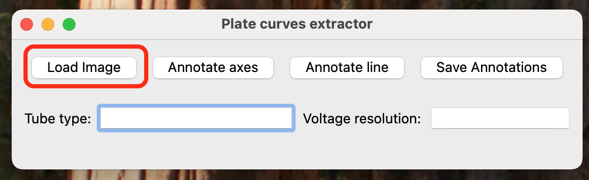
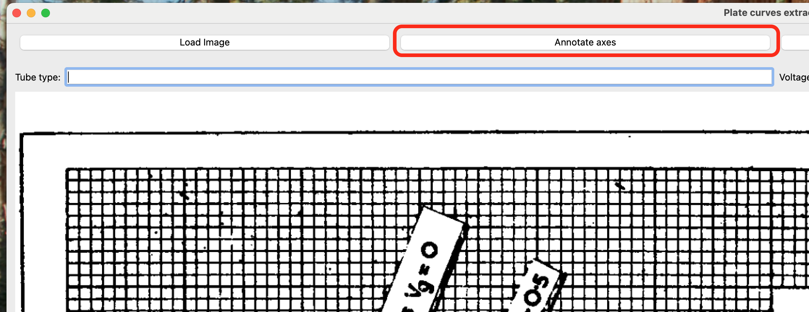
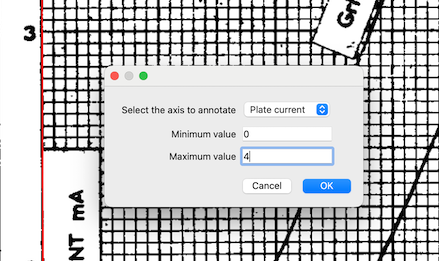

# Vacuum plate characteristics extractor

**vacu_graph** is a simple, Python-based, windowed and self-contained app (that still 
can be started from CLI)that helps to extract data from vacuum tubes plate / current characteristics. 

It's intended to help extract a tube characteristic data (plate current curves) so 
they can be used to build better defined Spice models. 
**NOTE:** automatic Spice model estimation will be added in the
future.

## Build / install from source
To build the app, run the following command from the root folder

```bash
pyinstaller --onefile --windowed --name vacu_graph --paths=. vacu_graph/app.py 
```
The app will be available in the `dist` folder and should contain two versions: CLI executable, and
a self-contained executable.

## Installation
### Environment setup for CLI


## Using the app
Here's some basic steps to use the app; we will use a 12AX7 / ECC83 tube example here.

1. Load the image with the tube characteristics.



2. Annotate the axes first to set up the resolution and parameters for each axis.
    1. Click on the Annotate axes button.

    

    2. Draw a line from the origin of the char to a characteristic point on the chart. In the example below, we drew a line from 0mA to 4mA for the plate current axis. In the modal that shows up select the axis and input the minimum and maximum values in the relevant fields.
    
    

    > [!IMPORTANT]  
    > if you drew a horizontal line and by accident forgot to change the axis to `Plate voltage` 
    > the tool will alert you about it and you'll need to click again on the Annotate axes, draw the 
    > line and fill the information in the dialog window again.

## Contributing to `vacu_graph`

We welcome contributions to **vacu_graph** and appreciate your interest in improving the project! Contributions can take many forms, including reporting bugs, suggesting features, improving documentation, or submitting code.

## Types of Contributions

### 1. Reporting Issues or Requesting Features

To report a bug, request a new feature, or identify an issue with the documentation:

- Please [open an issue](https://github.com/your-username/vacu_graph/issues) on GitHub.
- Provide as much detail as possible, including steps to reproduce the issue or a clear description of the feature request.
- The **vacu_graph** team will triage and evaluate the issue. If you feel an issue is particularly urgent, you can comment on it to bring it to our attention.

### 2. Proposing and Implementing New Features

If you would like to propose a new feature:

- First, file a feature request as a GitHub issue.
- Describe the proposed feature and your intended approach to implementing it.
- Use the issue to start a discussion with the maintainers and community.
- Once there is agreement on the approach, you're welcome to start development. Follow the coding guidelines in the next section when submitting a pull request.

### 3. Fixing Bugs or Implementing Enhancements

If you're working on an issue that already exists:

- Let others know by commenting on the issue.
- If you need clarification, don't hesitate to ask in the comments.
- When you're ready, submit a pull request that references the issue number. Be sure your code adheres to the style and testing guidelines described in the code contributions section.

## Code Contributions

Coming soon: A detailed guide on how to set up your environment, run tests, and follow coding conventions for **vacu_graph**. In the meantime, please:

- Write clean, readable code.
- Include appropriate tests for new features or bug fixes.
- Document any public interfaces you add or modify.

## Code of Conduct

All contributors are expected to follow our [Code of Conduct](CODE_OF_CONDUCT.md). Please treat others with respect and contribute in a way that fosters a welcoming and inclusive community.

---

Thank you for your contributions and support!